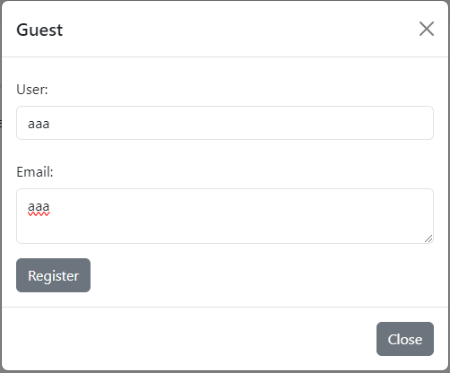
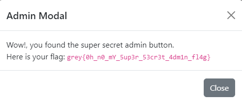

## Writeup

- Difficulty: 100 pts / 1000 pts
- Description: I just learnt how to design my favourite flask webpage using htmx and bootstrap. I hope I don't accidentally expose my super secret flag.
- Flag: `grey{0h_n0_mY_5up3r_53cr3t_4dm1n_fl4g}`

We are given a login site and the source code.


Based off the source code, there is a check for the session.
The site also uses `Flask` framework so we could assume that the cookie creation is based off that.



After signing up and grabbing the session cookie, we can try to decode using `flask-unsign`


In the source code, it checks for `is_admin` and the secret is also provided. We can then change the cookie values accordingly.

```python
app.secret_key = "baby-web"
```


This is the result when we try to access the page with the new cookie.


Upon inspecting the page further to look for clues, we notice this.


There is a hidden button within the site.
We can just edit the html to remove the hidden function, which results in our flag.

