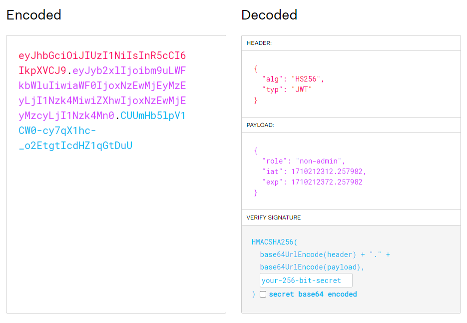
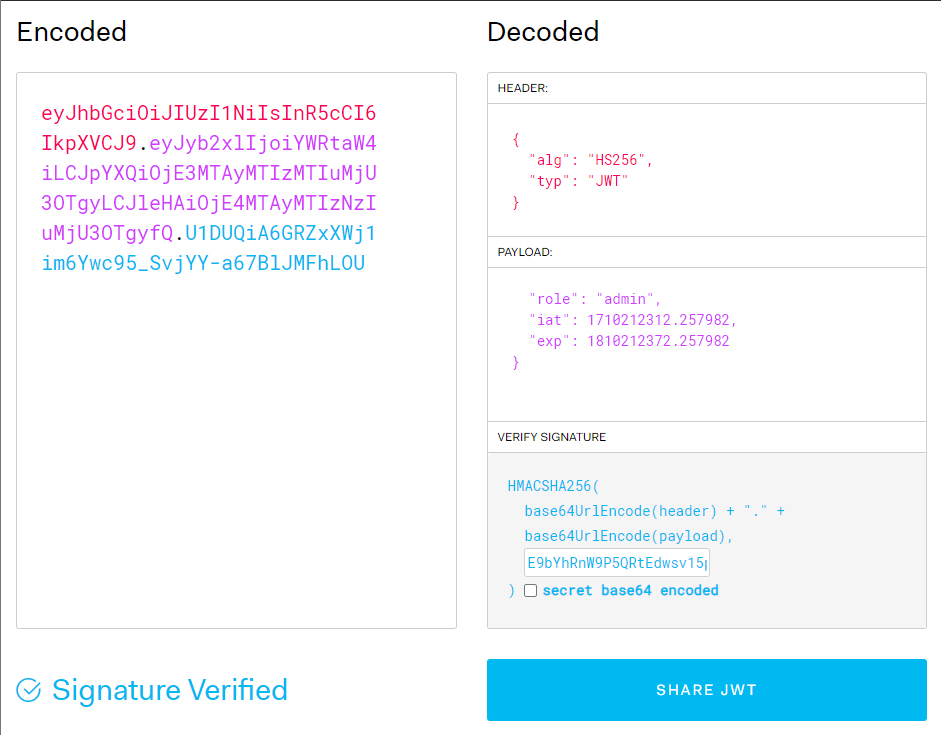

## Writeup

> Difficulty: Easy
> Description: A very simple web challenge
> Flag: `LNC24{5imp1e_Bu7_N0t_Simpl3}`

We are given the source code for the website, which seems to be a plain login site.

After reviewing the source code, this line in particular interests us the most.

<code>query = f"SELECT * FROM users WHERE username = '{username}' AND password = '{password}'"</code>

This line is vulnerable to SQL injection as the username and password is concatenated directly from the user input.
We can attempt to comment out the password using `' OR 'a'='a';--`

The results provides us a key, and also an authentication token, or more specifically, a JSON Web Token.

If we look at the parameters of the token, this is what we notice:
1. we are non-admin
2. expiration time of the token is 1 minute

We can adjust the parameters accordingly (give enough time for the token to not expire) and sign it with the given key.

During the discovery of the `role` parameter, we did some directory searching and `/admin` seems to exist

Add the new token and reload the site, we then obtain the flag

